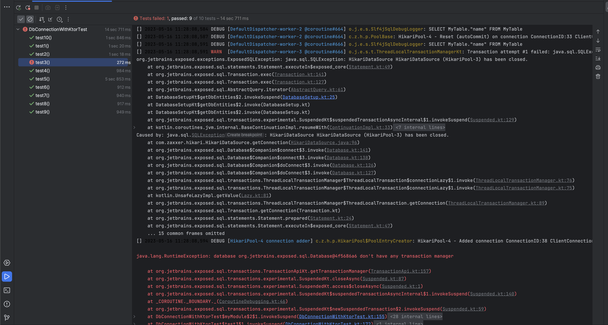

# Setup to reproduce ktor + exposed + hikaricp test failure

There seems to be some issue when combining Ktor's [testApplication](https://ktor.io/docs/testing.html#overview)
with Kotlin Exposed's "suspending transactions" and HikariCP.
It seems that the DB connections are sometimes leaking between the tests, i.e. test X 
uses a DB connection from a preceding test, which is then closed.
Because this behavior is flaky / not always occurring I created 10 identical tests inside the same class, 
to increase the probability of a test failure.

The problem does not seem to occur if I perform similar tests without `testApplication`. 
See `DbConnectionWithoutKtor.kt` for these tests. Moreover, `DbConnectionWithKtor.kt` does not seem
to fail with regular Exposed `transaction` (not suspending fun).

Steps to reproduce: 

* Run `DbConnectionWithKtorTest.kt` or `mvn test -Dtest=DbConnectionWithKtorTest` until it fails. Usually it fails within 5 runs.

Snippet of test failure:

Also see `error-test-run-complete.txt` for the log of a failed test run, 
and/or `error-test-run-specific-test.txt` for the log of specific test that failed